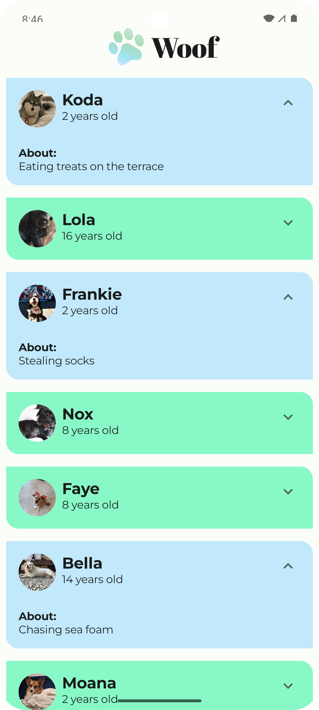

# Aplicación Woof 🐶📱

==================================

¡Bienvenido a Woof, una adorable aplicación de Android que muestra una lista de perritos con su información! 🐕

## 🌟 Sobre el Proyecto

La aplicación Woof es un proyecto diseñado para aprender y practicar los conceptos de **Material Design 3** y **Jetpack Compose** en Android. Muestra una lista interactiva de perros, cada uno con:

*   📸 Foto (¡circular y con estilo!)
*   📛 Nombre
*   🎂 Edad
*   ❤️ Pasatiempo favorito (¡que puedes expandir y contraer!)

## ✨ Características Implementadas

*   **Interfaz de Usuario Atractiva:** Construida con Jetpack Compose y siguiendo los principios de Material Design 3.
*   **Lista Dinámica de Perros:** Muestra múltiples perros, cada uno en una tarjeta (`Card`) individual.
*   **Barra Superior Personalizada (`TopAppBar`):** Incluye el logo 🐾 y el nombre de la aplicación "Woof".
*   **Elementos Expandibles:** Cada tarjeta de perro tiene un botón 🔽/🔼 para mostrar u ocultar información adicional sobre sus pasatiempos.
*   **Animaciones Fluidas:**
    *   Animación de cambio de tamaño (`animateContentSize`) al expandir/contraer la sección de pasatiempos.
    *   Animación de cambio de color de fondo (`animateColorAsState`) en la tarjeta al expandir/contraer.
*   **Temas Claro y Oscuro:** La aplicación soporta ambos temas para una mejor experiencia visual. 🎨
*   **Tipografía Personalizada:** Uso de fuentes específicas (Abril Fatface y Montserrat) para diferentes elementos de texto.
*   **Formas Personalizadas:** Las imágenes de los perros son circulares y las tarjetas tienen esquinas redondeadas de forma selectiva.

## 🚀 Introducción al Código Original

Este proyecto partió de un código base inicial con el objetivo de:

*   Aprender los fundamentos de Material3.
*   Reforzar los conceptos de Android Basics con Compose.

## 📋 Pre-requisitos (Conceptos Clave Utilizados)

*   Composable functions (`@Composable`)
*   Filas (`Row`) y Columnas (`Column`)
*   Modificadores (`Modifier`) para padding, tamaño, peso, etc.
*   `Scaffold` para la estructura básica de la pantalla.
*   Manejo de estado con `remember` y `mutableStateOf`.
*   Listas perezosas (`LazyColumn`).
*   Componentes de Material3: `Card`, `Text`, `Image`, `IconButton`, `Icon`, `CenterAlignedTopAppBar`.
*   Recursos de Android (strings, drawables, dimensiones).
*   Temas y Estilos (Colores, Tipografía, Formas).
*   Animaciones en Compose (`animateContentSize`, `animateColorAsState`, `spring`).

## 🏁 Empezando

1.  **Descarga el proyecto** 📥
2.  **Abre el proyecto en Android Studio** 💻 (Asegúrate de tener una versión compatible con Jetpack Compose).
3.  **Sincroniza el proyecto con los archivos Gradle** (Android Studio te lo pedirá si es necesario después de abrir el proyecto o si modificas los archivos `build.gradle.kts`).
4.  **Ejecuta el proyecto** ▶️ en un emulador o dispositivo físico.

## 🛠️ Estructura del Proyecto (Simplificada)

*   `MainActivity.kt`: Contiene la lógica principal de la UI y los componentes Composable.
*   `data/Dog.kt`: Define la clase de datos `Dog` y la lista de perros de ejemplo.
*   `ui/theme/`:
    *   `Color.kt`: Define la paleta de colores de la aplicación.
    *   `Theme.kt`: Configura el tema general de la aplicación (incluyendo tema claro/oscuro).
    *   `Type.kt`: Define los estilos de tipografía.
    *   `Shape.kt`: Define las formas personalizadas para los componentes.
*   `res/`: Contiene recursos como imágenes (drawables), strings, dimensiones, etc.
*   `build.gradle.kts (Module :app)`: Donde se declaran las dependencias, como `material-icons-extended`.

¡Explora el código y diviértete aprendiendo! 🎉
